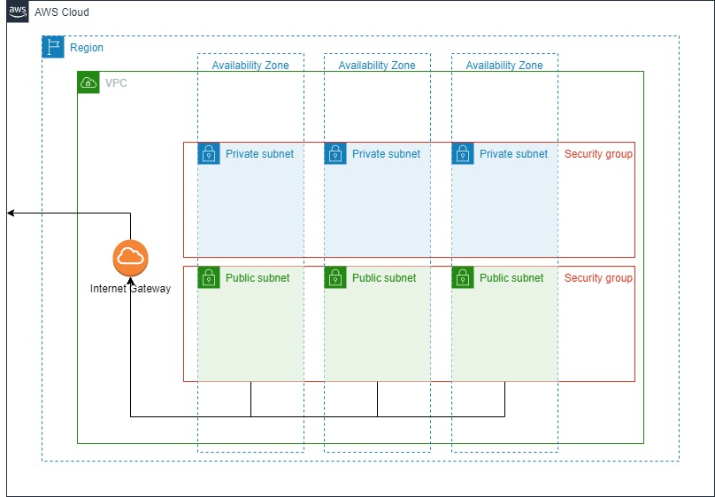

# CloudFormationVPC
AWS CloudFormation Template for generating: VPC, Internet Gateway, Subnets, RouteTables and Security Groups

# The following objects are created by this CloudFormation Template

| Object | Description |Example|
|-------------|------------------------|-------------------|
|VPC| The CIDR range is entered as a parameter.  This template was designed to use a /24 CIDR (256 addresses)|192.168.4.0/24|
|Internet Gateway|The internet gateway is attached to the VPC|
|Subnets|The template creates 6 subnets. There are a pair of subnets created in each AZ of the 3 AZs input as a parameter: one public, one private.   | ` 192.168.4.0/27 az1-private ` `192.168.4.32/27 az1-public ` |
| | | ` 192.168.4.64/27 az2-private `  ` 192.168.4.96/27 az2-public ` | 
| | | etc|
|Route Tables|A Public route table and a private route table are created.  The public route table routes all traffic through the internet gateway.  The private subnets are associated with the priate route table and the public subnets are associated with the public route table. ||
| Security Groups|Two security groups are created. sg01 allows ssh, rdp, 26257 and 8080 access from the IP entered as a parameter.    sg02 allows communication between the instances assigned to the sg02 security group.||

## The following parameters are required during the create stack process
|Parameter|Description|Example|
|---------|-------------------|----------------|
|VpcCidrParameter| The CIDR for the VPC|192.168.4.0|
|VpcNamePrefix|Used to construct the VPC name tag.  |If the parameter entered is "vpc01", the VPC name tag will be "vpc01-us-west-2"|
|VpcAzs|3 availability zones chosen from the list of AZs.  Be careful choosing the AZs.  Not all EC2 types are available in all AZs.  2 subnets will be created in each AZ: one public and one private.|"us-west-2a, us-west-2b, us-west-2c"|
|MyIP|An IP address which will be used to create the security group sg01.  When assigned to an EC2 instance the security group will allow SSH, RDP, 26257 and 8080 port access to this IP address.  The IP address will be appended with the CIDR range /32.  |36.250.22.1|

