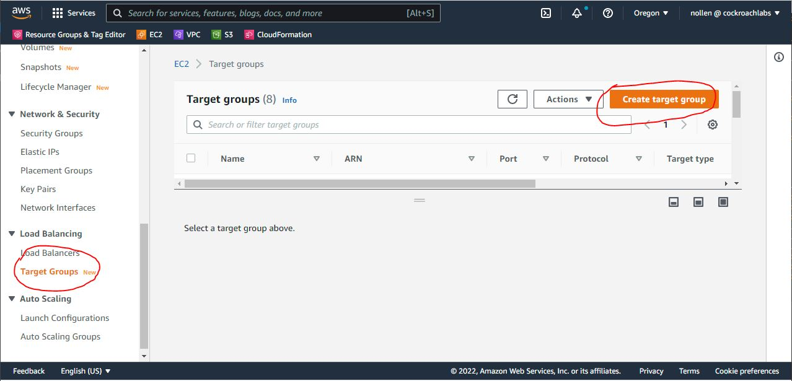
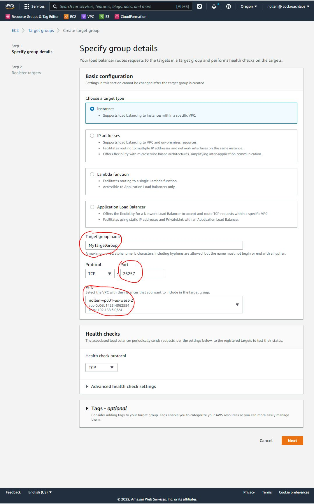
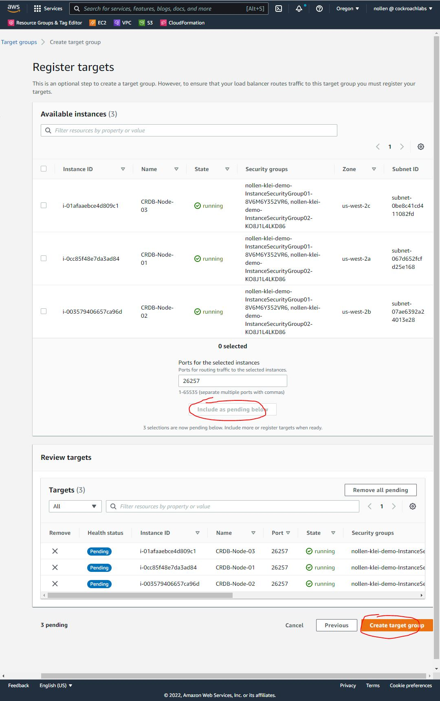
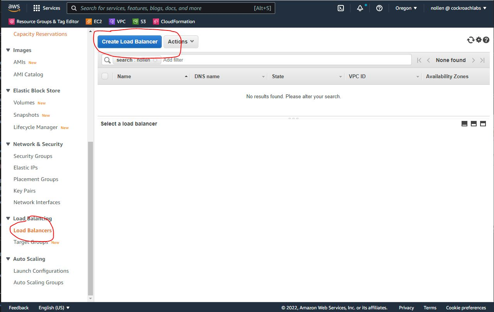
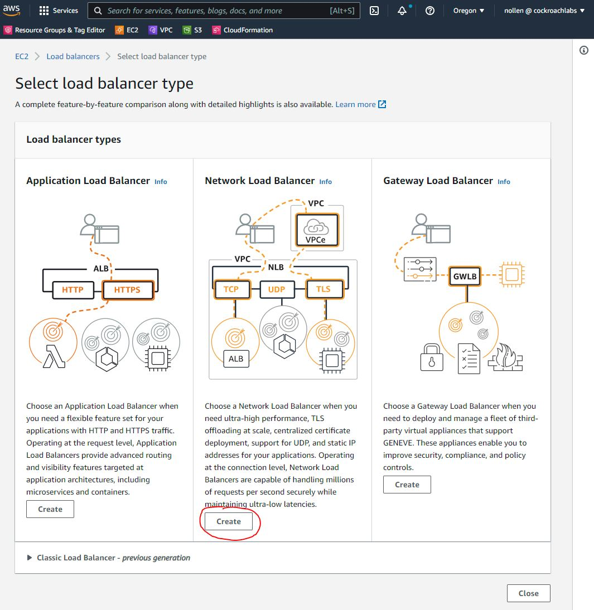
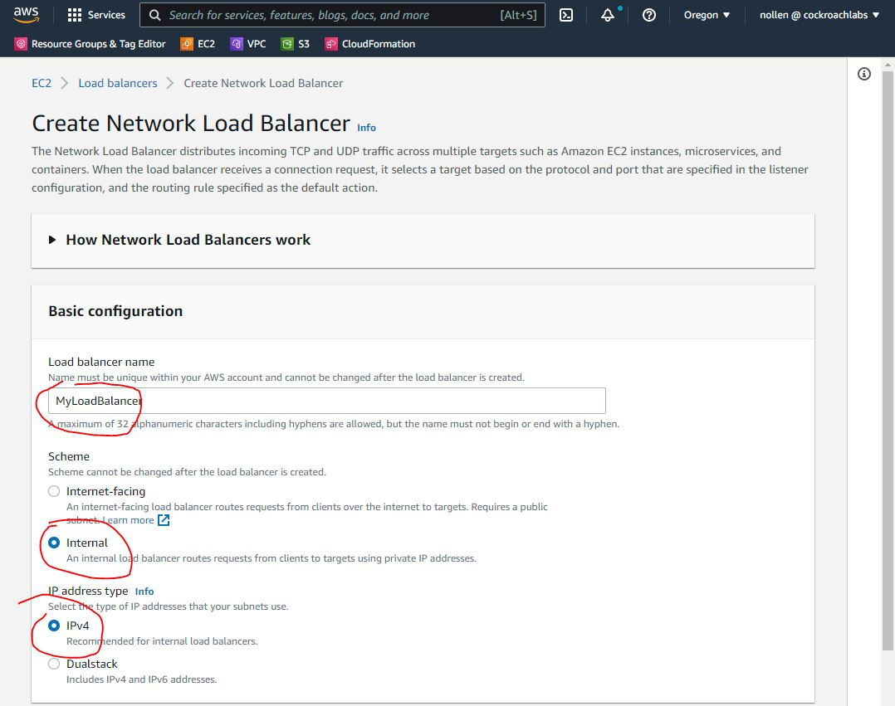
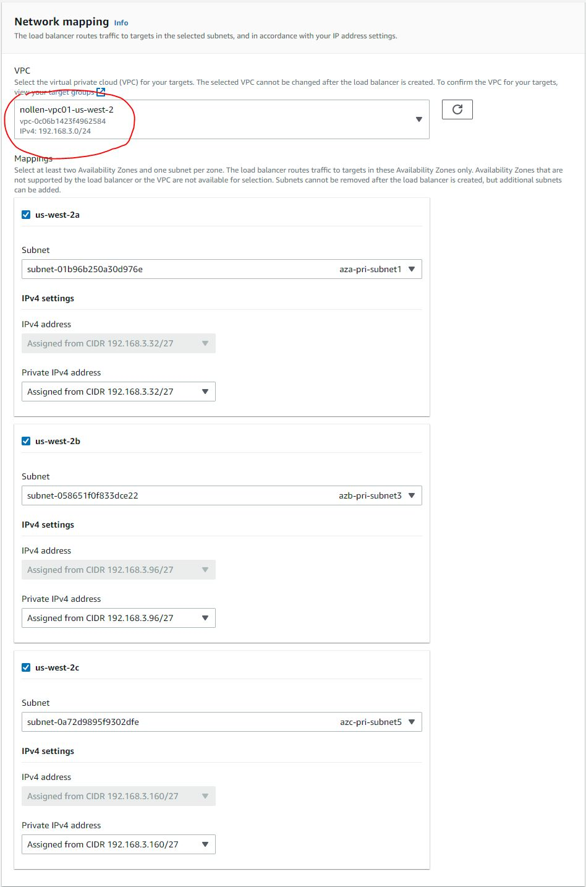
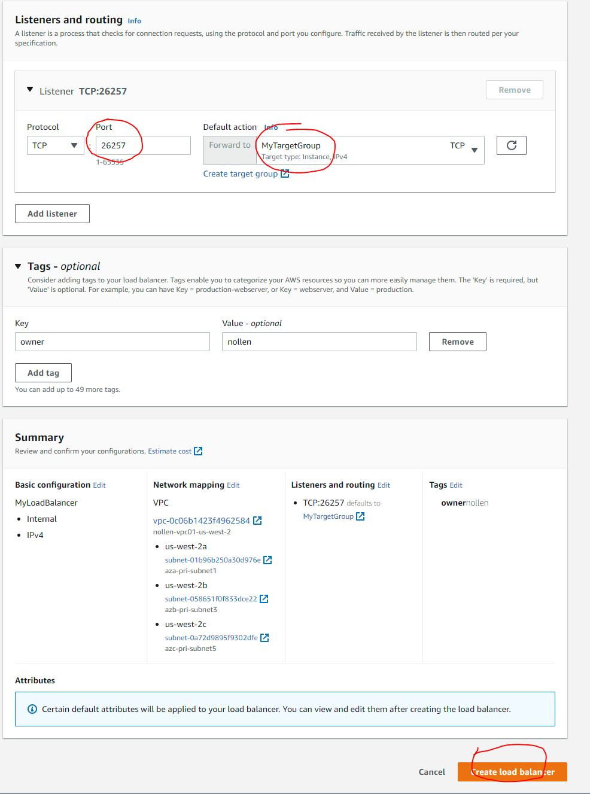
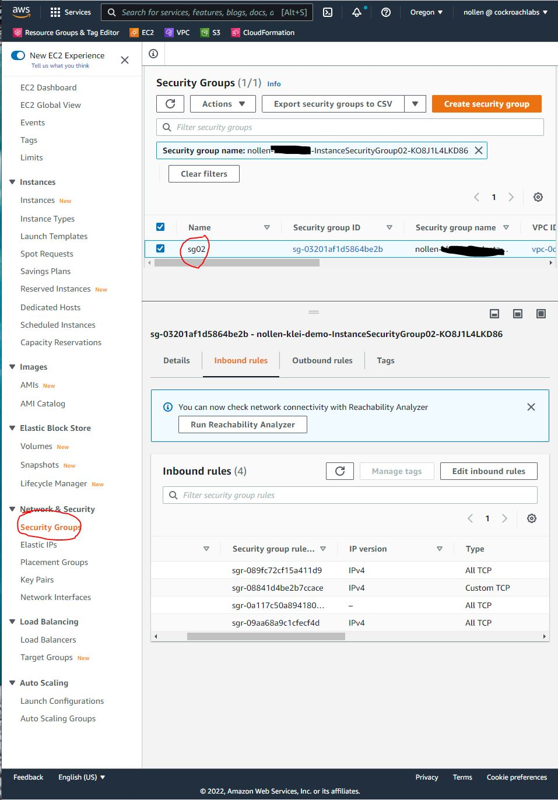
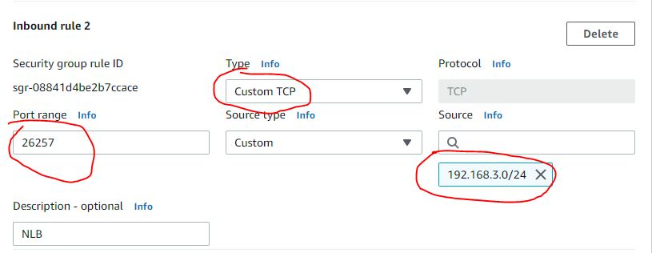

# Cockroach Database CloudFormation Template
AWS CloudFormation Template for generating: VPC, Internet Gateway, Subnets, RouteTables and Security Groups, EC2 Instances, installing CorkroachDB and certificates.  The cloudformation template usually takes less than 2 minutes to execute.
<br><br>
Once the infrastructure has been created, node and root certs will be generated and cockroachDB will be started.  You can choose to have the CloudFormation Template issue the "init" command, or you can do that manually (helpful when creating a multi-region cluster).
<br><br>
Running this Cloudformation Template in multiple Regions will allow you to create a Mulit-Region Cockroach Cluster, but there are a few extra steps to follow such as peering the VPCs, modifying route tables and security groups ([see instructions below](#multi-region)).
<br><br>
When the CloudFormation stack is deleted, all resources created by the template in a region are deleted as well including the VPC, Internet Gateway, Subnets, RouteTables, Security Groups and EC2 Instances.  No data is maintained or saved.
<br><br>
For instructions on creating a stack using this CloudFormation Template use the instructions [below](#running-this-cloudFormation-template-in-aws).  
<br><br>
For instructions on creating a stack using this CloudFormation Template via the CLI, use the instructions [located here](#Creating-the-stack-with-the-AWS-CLI)
<br><br>
For instructions on adding a Network Load Balancer to the infrastructure created by this CloudFormation Template, follow the instructions [below](#add-a-network-load-balancer)
 

# Security Warnings
**The ca.crt and ca.key created by this template are the same for all executions.**  Anyone with access to this CloudFormation template has the CA key for the cluster.

The keys can be roated using the instructions [here](https://www.cockroachlabs.com/docs/v21.2/rotate-certificates).  

You can also change the key by editing the CloudFormation template prior to execution.

The security groups only allow your IP to access the EC2 instances, so although the CA key is not private until changed, access to the cluster is very limited.
<br><br>

# The following objects are created by this CloudFormation Template

| Object | Description |Example|
|-------------|------------------------|-------------------|
|VPC| The CIDR range is entered as a parameter.  This template was designed to use a /24 CIDR (256 addresses)|10.173.12.0/24|
|Internet Gateway|The internet gateway is attached to the VPC|
|Subnets|The template creates 6 subnets. There are a pair of subnets created in each AZ of the 3 AZs input as a parameter: one public, one private.  | ` 10.173.12.0/27 az1-private ` <br> `10.173.12.32/27 az1-public ` <br> ` 10.173.12.64/27 az2-private ` <br> ` 10.173.12.96/27 az2-public ` <br> etc|
|Route Tables|A Public route table and a private route table are created.  The public route table routes all traffic through the internet gateway.  The private subnets are associated with the priate route table and the public subnets are associated with the public route table. ||
| Security Groups|Two security groups are created. sg01 allows ssh, rdp, 26257 and 8080 access from the IP entered as a parameter.    sg02 allows **all** communication between the instances assigned to the sg02 security group.||
|EC2 Instances|3 EC2 instances, one in each public subnet group.  The IP address of the EC2 instances will be ".4", ".68" and ".132", which are the 1st usable address in each public subnet.|If the public subnets are: <br>`10.173.12.0/27` <br>`10.173.12.64/27` <br>`10.173.12.128/27`<br> then the EC2 instances will have the following IP addresses:<br>`10.173.12.4`<br>`10.173.12.68`<br>`10.173.12.132`|
|CockroachDB|The cockroach database binary is downloaded and installed on all EC2 instances||
|Cockroach Certs|A ca.crt and ca.key are created by the CloudFormation template.  All executions of the template will generate the same ca.crt and ca.key.  Based on these certs, node certs and root cert will be generated on each EC2 instance.|`/home/ec2-user/certs/ca.crt`<br>`/home/ec2-user/my-safe-directory/ca.key`|
|.bashrc|The ec2-user .bashrc is modified by adding exports of several variables as well as functions to create the node cert, root cert and start the database.||


## The following parameters are required during the create stack process
|Parameter|Description|Example|
|---------|-------------------|----------------|
|VpcCidrParameter| The CIDR for the VPC|10.173.12.0  You'll need to be sure that the VPC CIDR is not in use.  You can check by visiting the VPC page in your region.|
|VpcNamePrefix|Used to construct the VPC name tag.  |If the parameter entered is "vpc01", the VPC name tag will be "vpc01-us-west-2"|
|VpcAzs|3 availability zones chosen from the list of AZs.  Be careful choosing the AZs.  Not all EC2 types are available in all AZs.  2 subnets will be created in each AZ: one public and one private.|"us-west-2a, us-west-2b, us-west-2c"|
|MyIP|An IP address which will be used to create the security group sg01.  When assigned to an EC2 instance the security group will allow SSH, RDP, 26257 and 8080 port access to this IP address.  The IP address will be appended with the CIDR range /32.  |36.250.22.1|
|KeyPairName|Applied to the EC2 instances when they are created.  This is a drop-down-list-box|My-us-west-2-kp|
|CRDBAMIID|Amazon Linux AMI ID.  This will be different for each region	|ami-00f7e5c52c0f43726|
|ClusterName|CockroachDB Cluster Name.  Appended to the "cockroach start" command.|My-CRDB-Cluster-01 |
|ExistingJoinString|If this is a multiple region cluster, the join string is avialable in the "OUTPUTS" section of the first CloudFormation Region.  Leave this as NONE if this is the 1st region|10.173.12.4,10.173.12.68,10.173.12.132 |
|Installpsql|Choosing 'YES' will install postgresql 13 so that you can run 'psql'.|YES|
|RunInit|Choosing 'YES' will cause 'cockroach init' be run on the 3rd node.  Choosing 'YES' will force the 3rd node to wait to be created until the first 2 nodes have completed, so the cloudformation process will take longer.  Choosing 'NO' will leave the init command to the operator.|YES|
|CockroachVersion|The version of CockroachDB you want to install and run.  The parameter is limited to a drop down list box of choices.|21.2.4|

If you're going to execute this template in multiple regions, be sure to choose non-overlaping CIDR blocks for each region.  For example:

|Region|CIDR|
|--------|-----------|
|us-west-2|10.173.12.0|
|us-east-1|10.173.13.0|
|us-east-2|10.173.15.0|

This will allow you to easily peer the 3 VPCs.  

# Template Exports
The following values are exported by the CloudFormation Template

|Resource|Export Name|Description|
|-----------|------------|-------------|
|VPC ID|"${AWS::StackName}-VPCID|The ID of the VPC created by this CloudFormation Template|
|Security Group 1 ID|"${AWS::StackName}-SecurityGroup1"|The ID of the security group which allows access to public resources from a single IP|
|Security Group 2 ID|"${AWS::StackName}-SecurityGroup1"|The ID of the security group which allows intra-node communication|
|JoinValue |Use this output as the "ExistingJoinString" parameter when creating additional regions.  | The CloudFormation Template creates this value when the 1st region is created.  |
<br><br>
You can stop reading here unless you are building a multi-region cluster.
<br><br>
 # Multi-Region
To create a multi-region CockroachDB Cluster:
1.  When running the CloudFormation Template, choose 'NO' to init the databases (you'll do then manually when you've completed the mulit-region setup).
2.  Use the CloudFormation template to create the database in the first region.  Once the stack is complete, navigate to the "OUTPUTS" section and find the "JoinValue".  You will use this value as a parameter in all subsequent regions.
2.  Run the CloudFormation template in additional regions.  Be sure to choose non-overlaping VPC CIDRs for each region.  In the "ExistingJoinString" parameter use the "JoinValue" from the "OUTPUTS" section of the 1st Region.  
3.  Once the stacks are created in each Region, you'll need to create VPC peering between all regions (for 3 regions there will be 3 vpc peering connections, for 4 regions there would be 6 and so on.)
4.  Edit the routes of public route table for each region adding the VPC CIDRs for all regions.  The Destination is the VPC CIDR routes and the target is the VPC Peering connections.  
5.  Edit the inbound rules of the security group (instance-security-group02) in each region.   The souce should be the VPC CIDRs.
6.  Log on to any one of the nodes and run `cockroach init`.  Once that is complete, the cluster should be up and running
<br><br><br>

## Mulit-Region Example (cockroach node status)
|  id |       address       |     sql_address     |  build  |         started_at         |         updated_at         |             locality             | is_available | is_live|
|-----|---------------------|---------------------|---------|----------------------------|----------------------------|----------------------------------|--------------|----------|
   1 | 10.173.12.4:26257   | 10.173.12.4:26257   | v21.1.9 | 2021-12-23 20:00:41.289793 | 2021-12-23 20:03:54.843964 | region=us-west-2,zone=us-west-2a | true         | true
   2 | 10.173.13.132:26257 | 10.173.13.132:26257 | v21.1.9 | 2021-12-23 20:00:42.407873 | 2021-12-23 20:03:55.921262 | region=us-east-1,zone=us-east-1c | true         | true
   3 | 10.173.13.68:26257  | 10.173.13.68:26257  | v21.1.9 | 2021-12-23 20:00:42.778194 | 2021-12-23 20:03:56.324225 | region=us-east-1,zone=us-east-1b | true         | true
   4 | 10.173.12.132:26257 | 10.173.12.132:26257 | v21.1.9 | 2021-12-23 20:00:42.928144 | 2021-12-23 20:03:56.477613 | region=us-west-2,zone=us-west-2c | true         | true
   5 | 10.173.12.68:26257  | 10.173.12.68:26257  | v21.1.9 | 2021-12-23 20:00:43.165414 | 2021-12-23 20:03:56.710054 | region=us-west-2,zone=us-west-2b | true         | true
   6 | 10.173.13.4:26257   | 10.173.13.4:26257   | v21.1.9 | 2021-12-23 20:00:43.607428 | 2021-12-23 20:03:57.129251 | region=us-east-1,zone=us-east-1a | true         | true
   7 | 10.173.14.68:26257  | 10.173.14.68:26257  | v21.1.9 | 2021-12-23 20:03:47.825816 | 2021-12-23 20:03:56.842498 | region=us-east-2,zone=us-east-2b | true         | true
   8 | 10.173.14.4:26257   | 10.173.14.4:26257   | v21.1.9 | 2021-12-23 20:03:48.597583 | 2021-12-23 20:03:57.61296  | region=us-east-2,zone=us-east-2a | true         | true
   9 | 10.173.14.132:26257 | 10.173.14.132:26257 | v21.1.9 | 2021-12-23 20:03:49.241007 | 2021-12-23 20:03:53.755784 | region=us-east-2,zone=us-east-2c | true         | true


When deleting stacks in a multi-region cluster, be sure to delete the VPC Peering Connections first.
<br><br><br><br>

# Running This CloudFormation Template in AWS

## Verify your VPC CIDR
Navigate to the VPC Services section of AWS and select "Your VPCs" from the side menu.  Verify that the IPv4 CIDR you want to use for this Stack is not in use.  For example, I may want to use 192.168.4.0/24, so I need to be sure that address space is not already in use in this region.


## Ensure you have a key-pair for the region
Without a key-pair, you won't be able to access the EC2 instances created as part of this CloudForamtion Template.

To list your existing key-pairs, navigate to the EC2 Section of the AWS Console and select "Key Pairs" from the side-bar menu which is under "Network & Security".    If you need to create a new key-pair, choose the "Create key pair" button and download your new key-pair to a safe location.


## Find your IP address
To find your IP address you can use Google and search for "my ip address".


## Run the CloudFormation Template to Create the Infrastructure
Navigate to the AWS CloudFormation Service and choose "Create stack".


### Load the Template
In the "Prerequisite - Prepare template" section, choose "Template is ready"
<br>
In the "Specify template" section, choose "Upload a template file"
<br>
Click the "Choose file" button and select the CloudFormation yaml file (crdb_cloudformation_template.yaml).


### Supply The Necessary Parameters
[Click here to see the parameter descriptions](#the-following-parameters-are-required-during-the-create-stack-process)


### Configure stack options
On the "Configure stack options" page, you can accept everything as-is and select the "Next" button.


### Review 
The final page is the "Review" page.  Select the "Next" button to create the stack.


### Create Complete
When your CloudFormation Template has completed, you will get a "CREATE_COMPLETE" Status message.   


To see the resources that were created, the outputs, or to review the parameters you selected, you can choose to see the Stack Details and select one of the Tabs from the screen.


# Delete the Stack
To delete the stack and all of the resources created as part of the stack, select the stack and hit the "Delete" button.  Once the process is complete, the EC2 instances will be terminated, and all resources will be gone.


# Creating the stack with the AWS CLI
```
aws cloudformation create-stack --stack-name myteststack --template-body file://crdb_cloudformation_template.yaml --cli-input-yaml file://crdb_cloudformation_cli_parameters.yaml
```

In order to create the stack in the AWS CLI, you'll need to have the following two files in your directory:
- crdb_cloudformation_template.yaml
- crdb_cloudformation_cli_parameters.yaml

The `crdb_cloudformation_template.yaml` is the cloudformation template and the `crdb_cloudformation_cli_parameters.yaml` file is the parameters needed to run the cloudformation template.

<br><br>

# Add a Network Load Balancer
To add a network load balancer to the infrastructure involves 3 steps
- creating the target group:  This is the list of instances to which the load balancer will send traffic
- create the load balancer and attach it to the target group
- modify the security group to allow the load balancer to reach the target group instances

(Note that in a multi-region setup you would probably want an NLB in each region so that users get directed to most appropriate, possibly closest node.)

Assume that we have created a Cockroach Cluster in 1 region with 3 nodes:

```
[ec2-user@ip-192-168-3-4 ~]$ cockroach node status
  id |       address       |     sql_address     |  build  |         started_at         |         updated_at         |             locality             | is_available | is_live
-----+---------------------+---------------------+---------+----------------------------+----------------------------+----------------------------------+--------------+----------
   1 | 192.168.3.4:26257   | 192.168.3.4:26257   | v21.2.3 | 2022-01-10 20:05:52.653956 | 2022-01-20 21:17:48.212539 | region=us-west-2,zone=us-west-2a | true         | true
   2 | 192.168.3.132:26257 | 192.168.3.132:26257 | v21.2.3 | 2022-01-10 20:05:54.215074 | 2022-01-20 21:17:49.768001 | region=us-west-2,zone=us-west-2c | true         | true
   3 | 192.168.3.68:26257  | 192.168.3.68:26257  | v21.2.3 | 2022-01-10 20:05:54.519396 | 2022-01-20 21:17:50.069444 | region=us-west-2,zone=us-west-2b | true         | true
```

## Create a target group for these instances:
Navigate to the EC2 console and from the menu on the left, choose "Target Groups" and "Create target group".


On the "Specify group details" page:
- select the most appropriate target type, I chose "instances"
- Give the group a name (MyTargetGroup in the example below)
- select "TCP" as the protocol and 26257 as the port (26257 is the CockroachDB Port)
- and select the VPC that was created as part of the CloudFormation (you can search by name)
- enter any appropriate tags
- click "Next"


On the "Register targets" page:
- select all of the instances in the "Available instances" section
- be sure the "Ports for the selected instances" is 26257
- select the "Include as pending below" button
- select the "Create target group" button.


## Create the load balancer
Navigate to the EC2 console and from the menu on the left, choose "Load Balancers".


Select "Create" Network Load Balancer from the "Select load balancer type" page.


On the "Create Network Load Balancer Page"
- Basic Configuration Section
   - Enter a load balancer name (MyLoadBalancer in the example)
   - select Internal from the Scheme radio buttons
   - select IPv4 from the IP Address type radio buttons
- Network Mapping Section
   - Enter the VPC created in the CloudFormation
   - select the private subnet for each availability zone (we're select the private subnets because we choose to create an internal load balancer.  If you choose to create an internet-facing load balancer, you would need to select public subnets here.)
- Listener, Tags and Summary Sections
   - Protocol should be "TCP"
   - Port is 26257
   - Forward To is the target group created above "MyTargetGroup"
   - Add any tags that are important for you
- Select "Create load balancer"





## Modify the Security Group
You'll need to modify the security group (sg02) created by the CloudFormation template to allow the load balancer to reach the Cockroach Nodes.

Navigate to the EC2 console  and from the menu on the left, choose "Security Groups" and find the sg02 security group.


Select the "Inbound Rules" rules tab in the bottom section of the screen and select "Edit inbound rules".

Enter a new security group rule with the following properties:
- Type is "Custom TCP"
- Port range is: 26257
- The source is the VPC CIDR range you selected during CloudFormation


## Health Check Status
Navigate back to the Target Groups Section and be sure Health Status of all the instances is "healthy" (it will take several minutes based on the health check default settings).

If you're having problems with the Health Check be sure to check your security group settings.


