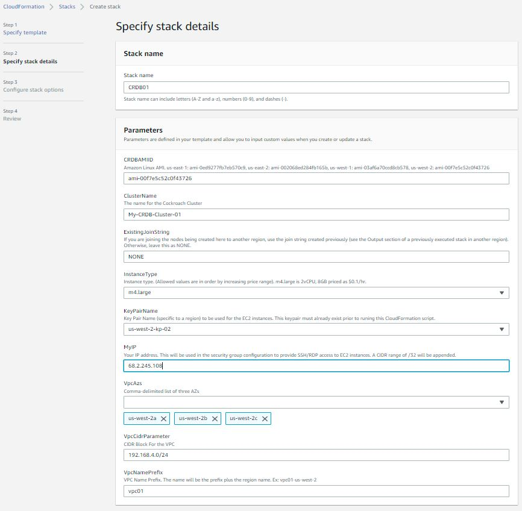

# Cockroach Database CloudFormation Template
AWS CloudFormation Template for generating: VPC, Internet Gateway, Subnets, RouteTables and Security Groups, EC2 Instances, installing CorkroachDB and certificates.  The cloudformation template usually takes less than 2 minutes to execute.

Once the infrastructre has been created, node and root certs will be generated and cockroachDB will be started (no init)

Running this Cloudformation Template in multiple Regions will allow you to create a Mulit-Region Cockroach Cluster, but there are a few extra steps to follow such as peering the VPCs, modifying route tables and security groups ([see instructions below](#multi-region)).

Note that when the CloudFormation stack is deleted, all resources created by the template in a region are deleted as well.

Prior to running this CloudFormation template, you must have 
- your public IP address (this is used to create the security group which allows only your IP to access the nodes)  You can find your IP by googling "my ip address"
- key pair [Create One Here](https://us-west-2.console.aws.amazon.com/ec2/v2/home?region=us-west-2#KeyPairs:).  The key pair information is used to allow you access the CRDB nodes.

The "Stack Details" page in AWS might look like this:

[Click here to see the parameter descriptions](#the-following-parameters-are-required-during-the-create-stack-process)

To initialize the cluster, you must issue the 'cockroach init' command from any one of the nodes in the cluster.

# Secuirty Warnings
The ca.crt and ca.key created by this template are the same for all executions!  Anyone with access to this CloudFormation template has the CA key for the cluster.

The keys can be roated using the instructions [here](https://www.cockroachlabs.com/docs/v21.2/rotate-certificates).  

You can also change the key by editing the CloudFormation template prior to execution.

# The following objects are created by this CloudFormation Template

| Object | Description |Example|
|-------------|------------------------|-------------------|
|VPC| The CIDR range is entered as a parameter.  This template was designed to use a /24 CIDR (256 addresses)|192.168.4.0/24|
|Internet Gateway|The internet gateway is attached to the VPC|
|Subnets|The template creates 6 subnets. There are a pair of subnets created in each AZ of the 3 AZs input as a parameter: one public, one private.  | ` 192.168.4.0/27 az1-private `   `192.168.4.32/27 az1-public `   ` 192.168.4.64/27 az2-private `   ` 192.168.4.96/27 az2-public `   etc|
|Route Tables|A Public route table and a private route table are created.  The public route table routes all traffic through the internet gateway.  The private subnets are associated with the priate route table and the public subnets are associated with the public route table. ||
| Security Groups|Two security groups are created. sg01 allows ssh, rdp, 26257 and 8080 access from the IP entered as a parameter.    sg02 allows **all** communication between the instances assigned to the sg02 security group.||
|EC2 Instances|3 EC2 instances, one in each public subnet group.  The IP address of the EC2 instances will be ".4", ".68" and ".132", which are the 1st usable address in each public subnet.|If the public subnets are:  `192.168.4.0/27`  `192.168.4.64/27`  `192.168.4.128/27`  then the EC2 instances will have the following IP addresses: `192.168.4.4` `192.168.4.68` `192.168.4.132`|
|CockroachDB|The cockroach database binary is downloaded and installed on all EC2 instances||
|Cockroach Certs|A ca.crt and ca.key are created by the CloudFormation template.  All executions of the template will generate the same ca.crt and ca.key.  Based on these certs, node certs and root cert will be generated on each EC2 instance.|`/home/ec2-user/certs/ca.crt` `/home/ec2-user/my-safe-directory/ca.key`|
|.bashrc|The ec2-user .bashrc is modified by adding exports of several variables as well as functions to create the node cert, root cert and start the database.||

## The following parameters are required during the create stack process
|Parameter|Description|Example|
|---------|-------------------|----------------|
|VpcCidrParameter| The CIDR for the VPC|192.168.4.0  You'll need to be sure that the VPC CIDR is not in use.  You can check by visiting the VPC page in your region.|
|VpcNamePrefix|Used to construct the VPC name tag.  |If the parameter entered is "vpc01", the VPC name tag will be "vpc01-us-west-2"|
|VpcAzs|3 availability zones chosen from the list of AZs.  Be careful choosing the AZs.  Not all EC2 types are available in all AZs.  2 subnets will be created in each AZ: one public and one private.|"us-west-2a, us-west-2b, us-west-2c"|
|MyIP|An IP address which will be used to create the security group sg01.  When assigned to an EC2 instance the security group will allow SSH, RDP, 26257 and 8080 port access to this IP address.  The IP address will be appended with the CIDR range /32.  |36.250.22.1|
|KeyPairName|Applied to the EC2 instances when they are created.  This is a drop-down-list-box|My-us-west-2-kp|
|CRDBAMIID|Amazon Linux AMI ID.  This will be different for each region	|ami-00f7e5c52c0f43726|
|ClusterName|CockroachDB Cluster Name.  Appended to the "cockroach start" command.|My-CRDB-Cluster-01 |
|ExistingJoinString|If this is a multiple region cluster, the join string is avialable in the "OUTPUTS" section of the first CloudFormation Region.  Leave this as NONE if this is the 1st region|192.168.4.4,192.168.4.68,192.168.4.132 |

If you're going to execute this template in multiple regions, be sure to choose non-overlaping CIDR blocks for each region.  For example:

|Region|CIDR|
|--------|-----------|
|us-west-2|192.168.3.0|
|us-east-1|192.168.4.0|
|us-east-2|192.168.5.0|

This will allow you to easily peer the 3 VPCs.  

# Template Exports
The following values are exported by the CloudFormation Template

|Resource|Export Name|Description|
|-----------|------------|-------------|
|VPC ID|"${AWS::StackName}-VPCID|The ID of the VPC created by this CloudFormation Template|
|Security Group 1 ID|"${AWS::StackName}-SecurityGroup1"|The ID of the security group which allows access to public resources from a single IP|
|Security Group 2 ID|"${AWS::StackName}-SecurityGroup1"|The ID of the security group which allows intra-node communication|
|JoinValue |Use this output as the "ExistingJoinString" parameter when creating additional regions.  | The CloudFormation Template creates this value when the 1st region is created.  |
  
You can stop reading here unless you are building a multi-region cluster.
  
 # Multi-Region
To create a multi-region CockroachDB Cluster:
1.  Use the CloudFormation template to create the database in the first region.  Once the stack is complete, navigate to the "OUTPUTS" section and find the "JoinValue".  You will use this value as a parameter in all subsequent regions.
2.  Run the CloudFormation template in additional regions.  Be sure to choose non-overlaping VPC CIDRs for each region.  In the "ExistingJoinString" parameter use the "JoinValue" from the "OUTPUTS" section of the 1st Region.  
3.  Once the stacks are created in each Region, you'll need to create VPC peering between all regions (for 3 regions there will be 3 vpc peering connections, for 4 regions there would be 6 and so on.)
4.  Edit the routes of public route table for each region adding the VPC CIDRs for all regions.  The Destination is the VPC CIDR routes and the target is the VPC Peering connections.  
5.  Edit the inbound rules of the security group (instance-security-group02) in each region.   The souce should be the VPC CIDRs.
6.  Log on to any one of the nodes and run `cockroach init`.  Once that is complete, the cluster should be up and running
   

|  id |       address       |     sql_address     |  build  |         started_at         |         updated_at         |             locality             | is_available | is_live|
|-----|---------------------|---------------------|---------|----------------------------|----------------------------|----------------------------------|--------------|----------|
   1 | 192.168.4.4:26257   | 192.168.4.4:26257   | v21.1.9 | 2021-12-23 20:00:41.289793 | 2021-12-23 20:03:54.843964 | region=us-west-2,zone=us-west-2a | true         | true
   2 | 192.168.5.132:26257 | 192.168.5.132:26257 | v21.1.9 | 2021-12-23 20:00:42.407873 | 2021-12-23 20:03:55.921262 | region=us-east-1,zone=us-east-1c | true         | true
   3 | 192.168.5.68:26257  | 192.168.5.68:26257  | v21.1.9 | 2021-12-23 20:00:42.778194 | 2021-12-23 20:03:56.324225 | region=us-east-1,zone=us-east-1b | true         | true
   4 | 192.168.4.132:26257 | 192.168.4.132:26257 | v21.1.9 | 2021-12-23 20:00:42.928144 | 2021-12-23 20:03:56.477613 | region=us-west-2,zone=us-west-2c | true         | true
   5 | 192.168.4.68:26257  | 192.168.4.68:26257  | v21.1.9 | 2021-12-23 20:00:43.165414 | 2021-12-23 20:03:56.710054 | region=us-west-2,zone=us-west-2b | true         | true
   6 | 192.168.5.4:26257   | 192.168.5.4:26257   | v21.1.9 | 2021-12-23 20:00:43.607428 | 2021-12-23 20:03:57.129251 | region=us-east-1,zone=us-east-1a | true         | true
   7 | 192.168.6.68:26257  | 192.168.6.68:26257  | v21.1.9 | 2021-12-23 20:03:47.825816 | 2021-12-23 20:03:56.842498 | region=us-east-2,zone=us-east-2b | true         | true
   8 | 192.168.6.4:26257   | 192.168.6.4:26257   | v21.1.9 | 2021-12-23 20:03:48.597583 | 2021-12-23 20:03:57.61296  | region=us-east-2,zone=us-east-2a | true         | true
   9 | 192.168.6.132:26257 | 192.168.6.132:26257 | v21.1.9 | 2021-12-23 20:03:49.241007 | 2021-12-23 20:03:53.755784 | region=us-east-2,zone=us-east-2c | true         | true

When deleting stacks in a multi-region cluster, be sure to delete the VPC Peering Connections first.